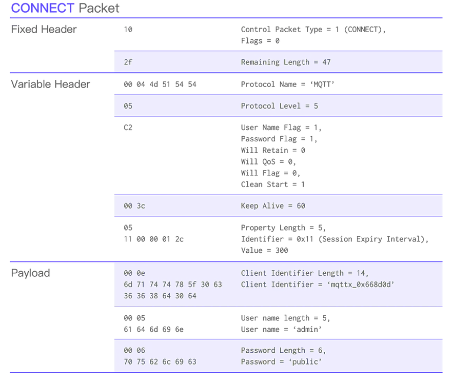
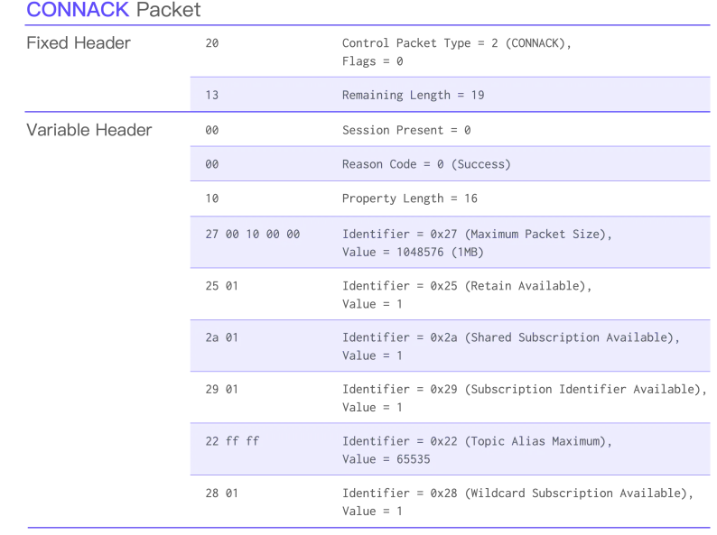
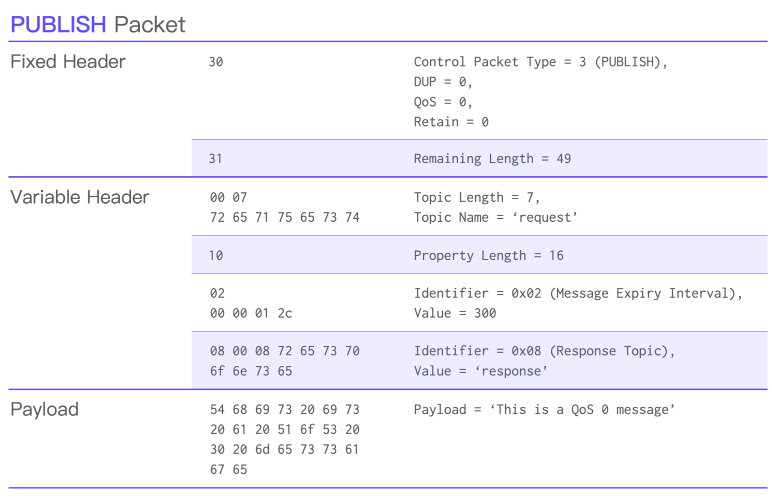
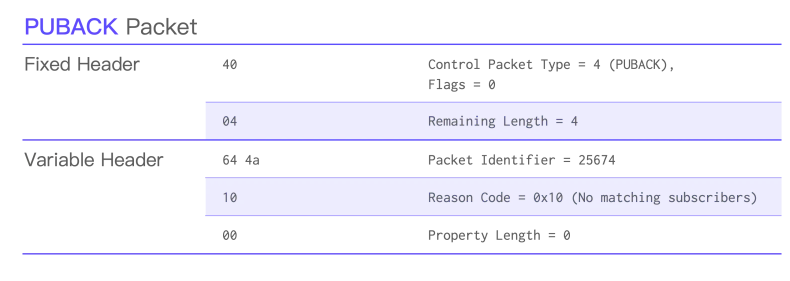
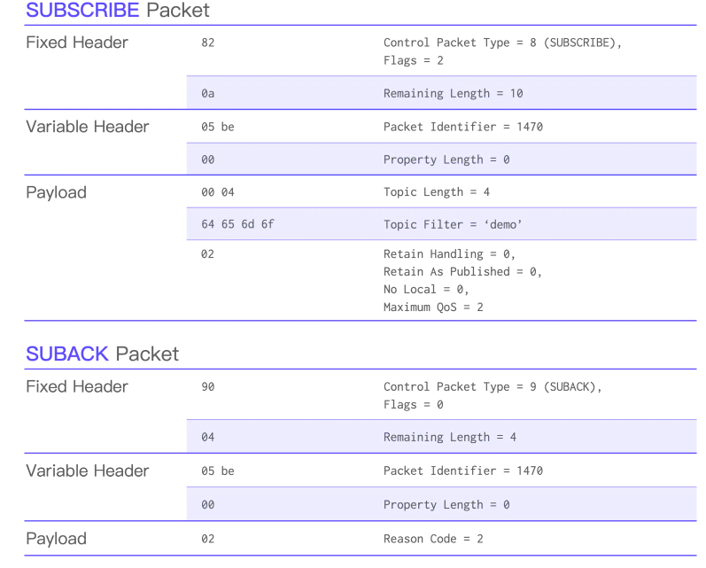

# MQTT v5 Client – Documentație Tehnică

## 1. Introducere
Protocolul **MQTT v5** (*Message Queuing Telemetry Transport*, versiunea 5.0) este un protocol ușor, optimizat pentru comunicații **machine-to-machine (M2M)** și **Internet of Things (IoT)**.  
Bazat pe modelul **publish–subscribe**, acesta funcționează peste stiva **TCP/IP**, oferind mecanisme de livrare fiabilă, control al fluxului și persistență a mesajelor.

În cadrul acestui proiect se implementează un **client MQTT v5** utilizând exclusiv modulul `socket` din Python, fără biblioteci externe.

Scopul proiectului este construirea unei aplicații demonstrative pentru **monitorizarea parametrilor de sistem** (CPU, memorie, temperatură) și publicarea acestora periodic pe topicuri MQTT dedicate.

Aplicația include o **interfață grafică (GUI)** care permite:
- configurarea conexiunii cu brokerul MQTT,
- alegerea ID-ului clientului și a mesajului *Last Will*,
- vizualizarea în timp real a parametrilor locali și a celor primiți de la alte instanțe ale aplicației.


---

## 2. Arhitectura aplicației
Aplicația este construită pe o arhitectură **client–broker**, conform specificației MQTT v5.  
Brokerul gestionează toate conexiunile și distribuie mesajele publicate către abonații corespunzători.

**Componente principale:**
- **Brokerul MQTT (HiveMQ 4.46)** – gestionează topicurile și distribuția mesajelor.  
- **Clientul MQTT v5 (`client.py`)** – implementează funcțiile principale ale protocolului MQTT (`CONNECT`, `PUBLISH`, `SUBSCRIBE`, `PINGREQ`, `DISCONNECT` etc.) utilizând doar `socket`.  
- **Interfața grafică (`gui.py`)** – oferă un panou de control pentru configurarea clientului și vizualizarea datelor.  
- **Modulul de monitorizare (`monitor.py`)** – colectează parametrii sistemului (CPU, RAM, temperatură) și îi publică periodic.  
- **Protocolul (`protocol.py`)** – definește formatele binare ale pachetelor MQTT v5 și mecanismele QoS.

---

## 3. Protocolul de comunicație MQTT v5

### Model de comunicare
MQTT folosește un model **publish–subscribe**, în care:
- **Publisherul** trimite mesaje pe un *topic*.
- **Subscriberul** primește mesajele publicate pe topicurile la care este abonat.
- **Brokerul** central gestionează toate mesajele și conexiunile.

Comunicarea se realizează prin **pachete binare** transmise prin socket TCP, structurate conform specificației MQTT v5.

### Tipuri de pachete implementate
- `CONNECT` / `CONNACK`
- `PUBLISH` / `PUBACK` / `PUBREC` / `PUBREL` / `PUBCOMP`
- `SUBSCRIBE` / `SUBACK`
- `PINGREQ` / `PINGRESP`
- `DISCONNECT`

### Structura generală a unui pachet MQTT v5
| Secțiune | Descriere |
|-----------|------------|
| **Fixed Header** | Tipul pachetului (4 biți), flag-uri și lungimea totală |
| **Variable Header** | Parametri specifici fiecărui tip de mesaj (ex: topic, ID pachet) |
| **Payload** | Conținutul efectiv (datele publicate) |

---

## 4. Funcționalități implementate

### 1. Configurare conexiune
Prin interfața grafică, utilizatorul poate introduce:
- adresa brokerului (IP / hostname),
- portul TCP (implicit **1883**),
- ID-ul clientului MQTT,
- mesajul **Last Will**,
- datele de autentificare (username, parolă).

### 2. Autentificare
Pachetul `CONNECT` include câmpurile:
- *User Name Flag* și *Password Flag* în Fixed Header,
- câmpurile de autentificare în Payload.

Astfel, brokerul poate verifica clientul înainte de a permite trimiterea de mesaje.

### 3. Mecanism **Keep Alive**
Mecanismul **Keep Alive** menține conexiunea activă între client și broker:
- Clientul transmite în pachetul `CONNECT` un câmp *Keep Alive* (în secunde).
- Trimite periodic un pachet `PINGREQ` dacă nu a existat trafic.
- Brokerul răspunde cu `PINGRESP`.
- Dacă brokerul nu primește `PINGREQ` în perioada specificată → conexiunea se închide și brokerul publică *Last Will*.

### 4. Mecanisme **QoS (Quality of Service)** – flux asincron

Aplicația implementează toate cele trei niveluri QoS definite de MQTT:

| Nivel | Descriere | Caracteristici |
|-------|------------|----------------|
| **QoS 0 – At most once** | Mesaj trimis o singură dată fără confirmare | Fără garanție, rapid |
| **QoS 1 – At least once** | Mesaj retransmis până la confirmare `PUBACK` | Posibilă duplicare. Mesajele sunt stocate într-un buffer și retransmise periodic până la primirea confirmării; după PUBACK, mesajul este eliminat. Flux asincron, gestionat de thread-uri dedicate. |
| **QoS 2 – Exactly once** | Flux complet: `PUBLISH → PUBREC → PUBREL → PUBCOMP` | Garanție unică livrare. Starea fiecărui mesaj este urmărită în buffer pentru a garanta livrarea o singură dată. Fluxul este asincron, cu thread-uri separate pentru transmitere și recepție. |

#### Flux asincron QoS 1 și QoS 2
- Fiecare mesaj publicat este asociat unui `packet_id` și stocat într-un buffer.
- **TransmitThread**: trimite mesajele PUBLISH din buffer fără a bloca GUI-ul.
- **ReceiveThread**: procesează răspunsurile brokerului (`PUBACK`, `PUBREC`, `PUBREL`, `PUBCOMP`) și actualizează starea mesajelor.
- **Cozi thread-safe (Queue)** între transmitere și recepție pentru sincronizare și siguranța datelor.
- Această arhitectură permite funcționarea paralelă a thread-urilor de monitorizare și comunicație, menținând interfața grafică responsivă.

### 5. Mecanism **Last Will**
Mesajul *Last Will* este publicat automat de broker în caz de deconectare neașteptată a clientului, informând ceilalți abonați.

---

## 5. Aplicație demonstrativă – Monitorizare sistem

Clientul colectează și publică periodic parametrii sistemului:

| Parametru | Descriere | Topic MQTT |
|------------|------------|-------------|
| `cpu_load` | Gradul de utilizare al procesorului (%) | `sistem/<client_id>/cpu` |
| `mem_usage` | Memorie utilizată (%) | `sistem/<client_id>/mem` |
| `temperature` | Temperatura procesorului (°C) | `sistem/<client_id>/temp` |

Publicarea se face la fiecare **5 secunde** în format JSON:

```json
{
  "cpu": 47.5,
  "ram": 62.1,
  "temperatura": 54.3,
  "uptime": 13425
}
```

QoS-ul se poate selecta din interfață.

---

## 6. Interfața grafică (GUI)

Interfața, realizată cu **Tkinter**, oferă următoarele componente:

| Componentă | Rol |
|-------------|-----|
| **Broker address** | Adresa IP sau numele brokerului |
| **Port** | Portul TCP (implicit 1883) |
| **Client ID** | Identificator unic al clientului |
| **Username / Password** | Date de autentificare |
| **Last Will message** | Mesaj publicat automat la deconectare |
| **Keep Alive** | Interval PINGREQ |
| **QoS** | Nivel QoS pentru publicare |
| **Connect / Disconnect** | Inițiere / terminare conexiune |
| **Start / Stop Monitor** | Control publicare periodică |
| **Log Window** | Evenimente MQTT (connect, publish, ping etc.) |
| **Received Data Table** | Parametrii primiți de la alte instanțe |

```
┌────────────────────────────────────────────┐
│                CLIENT MQTTv5               │
├────────────────────────────────────────────┤
│ 1. Conectare Broker                        │
│                                            │
│  ┌───────────────┐     ┌──────────────┐    │
│  │ Broker addr.  │     │    Port      │    │
│  └───────────────┘     └──────────────┘    │
│                                            │
│               ┌──────────────┐             │
│               │  Keep Alive  │             │
│               └──────────────┘             │
│                                            │
│  ┌──────────────┐     ┌──────────────┐     │
│  │  Client ID   │     │   Password   │     │
│  └──────────────┘     └──────────────┘     │
│                                            │
│               ┌──────────────┐             │
│               │  Username    │             │
│               └──────────────┘             │
│                                            │
│           ┌────────────────────┐           │
│           │  Last Will message │           │
│           └────────────────────┘           │
│                                            │
│   QoS:  ( ) 0     ( ) 1     ( ) 2          │
│                                            │
│         [ CONNECT / DISCONNECT ]           │
├────────────────────────────────────────────┤
│ 2. Control monitorizare sistem             │
│                                            │
│     [ START MONITOR / STOP MONITOR ]       │
│                                            │
│  ┌────────────────────────┐                │
│  │  Jurnal / Evenimente   │                │
│  │  (fereastră permanent  │                │
│  │   vizibilă)            │                │
│  └────────────────────────┘                │
└────────────────────────────────────────────┘
```

---

## 7. Structura modulelor

Aplicația este modulară, separând clar logica de comunicație, GUI-ul și partea de monitorizare.

### `client.py`
- Modulul principal.
- Inițializează conexiunea TCP cu brokerul.
- Construiește și trimite pachetele MQTT (`CONNECT`, `PUBLISH`, `SUBSCRIBE`, `PINGREQ`, `DISCONNECT`).
- Primește răspunsurile (`CONNACK`, `PUBACK`, `PINGRESP` etc.).
- Gestionează autentificarea, *Last Will*, *Keep Alive* și reconectarea automată.

### `protocol.py`
- Definește funcțiile de construcție și interpretare a pachetelor MQTT v5.
- Exemple de funcții:
  - `encode_connect()`, `decode_connack()`
  - `encode_publish()`, `decode_puback()`
  - `encode_subscribe()`, `decode_suback()`
  - `encode_pingreq()`, `decode_pingresp()`
  - `encode_disconnect()`
- Respectă structura oficială MQTT, incluzând calculul *Remaining Length*.

### `monitor.py`
- Colectează date despre sistem (CPU, RAM, temperatură, uptime).
- Utilizează biblioteci standard (`os`, `psutil`, `platform`).
- Trimite valorile către `client.py` pentru publicare periodică.

### `gui.py`
- Implementează interfața grafică cu **Tkinter**.
- Permite configurarea conexiunii și controlul monitorizării.
- Afișează în timp real mesajele publicate și primite.

---

## 8. Testare și demonstrații

### Scenariu 1 – Conectare și autentificare
- Clientul se conectează la broker cu user/parolă.
- Brokerul răspunde cu `CONNACK` (cod 0 – succes).
- În caz de credentiale invalide → cod de eroare.

### Scenariu 2 – Publicare QoS 0 / 1 / 2
- QoS 0: mesaje fără ACK.
- QoS 1: `PUBACK` și retransmisie la timeout.
- QoS 2: flux complet `PUBREC → PUBREL → PUBCOMP`.

### Scenariu 3 – Keep Alive
- `PINGREQ` la fiecare 60 secunde.
- `PINGRESP` de la broker.
- La lipsa răspunsului → reconectare automată.

### Scenariu 4 – Pierdere conexiune și Last Will
- Clientul este închis forțat.
- Brokerul publică *Last Will*.
- Alte instanțe primesc notificarea.

---

## 9. Proiectarea aplicației

Aplicația este proiectată conform principiilor **programării orientate pe obiecte (OOP)** și utilizează un model **multi-threaded** pentru a separa sarcinile critice: comunicația de rețea, colectarea datelor de sistem, actualizarea interfeței grafice și menținerea conexiunii active cu brokerul.

---

### 9.1. Arhitectura pe thread-uri

Pentru a asigura funcționarea fluentă și responsivă a aplicației, sunt folosite **cinci fire de execuție principale**, fiecare având roluri bine definite:

| Thread | Componentă | Responsabilități principale |
|---------|-------------|-----------------------------|
| **Thread principal (UI Thread)** | `gui.py` | Inițializează și rulează bucla principală Tkinter. Gestionează interfața, inputul utilizatorului și actualizarea componentelor vizuale. |
| **TransmitThread (MQTT)** | `client.py` | Trimite mesajele PUBLISH din buffer pentru QoS 1 și QoS 2 fără a bloca GUI-ul. |
| **ReceiveThread (MQTT)** | `client.py` | Procesează răspunsurile brokerului (`PUBACK`, `PUBREC`, `PUBREL`, `PUBCOMP`) și actualizează starea mesajelor QoS 1 și QoS 2. |
| **Thread de monitorizare sistem** | `monitor.py` | Colectează periodic parametrii sistemului (CPU, RAM, temperatură, uptime) și îi transmite către clientul MQTT pentru publicare. |
| **Thread Keep Alive / PING** | `client.py` | Trimite periodic pachete `PINGREQ` pentru a menține conexiunea activă. Monitorizează timpul de inactivitate și inițiază reconectarea automată la nevoie. |

**Comunicarea între thread-uri** se realizează prin:
- **Queue-uri (thread-safe)** pentru trimiterea mesajelor între GUI și clientul MQTT și între transmit/receive threads.
- **Evenimente (`threading.Event`)** pentru controlul pornirii/opriri monitorizării.
- **Lock-uri (`threading.Lock`)** pentru acces sincronizat la socket.

---

### 9.2. Clase principale (OOP Design)

Aplicația este structurată pe clase modulare, care separă clar logica de comunicație, procesare și interfață.

#### 1. `MQTTClient`
**Rol:** reprezintă clientul MQTT propriu-zis și gestionează întregul ciclu de viață al conexiunii.

**Responsabilități:**
- Stabilirea conexiunii TCP cu brokerul.
- Trimiterea pachetelor `CONNECT`, `PUBLISH`, `SUBSCRIBE`, `PINGREQ`, `DISCONNECT`.
- Gestionarea autentificării și a mesajului *Last Will*.
- Implementarea mecanismelor QoS 0–2.
- Recepția și interpretarea pachetelor de răspuns (`CONNACK`, `PUBACK`, etc.).
- Menținerea conexiunii prin *Keep Alive* și reconectare automată.

**Atribute principale:**
- `broker_host`, `broker_port`, `client_id`
- `socket`
- `keep_alive`, `last_will`, `username`, `password`
- `connected`
- `protocol_encoder`, `protocol_decoder`

**Metode cheie:**
- `connect`
- `disconnect`
- `publish`
- `subscribe`
- `loop_receive`
- `send_ping`

---

#### 2. `ProtocolEncoder`
**Rol:** se ocupă cu **generarea pachetelor binare MQTT v5** conform specificației.

**Responsabilități:**
- Construcția pachetelor pentru fiecare tip de mesaj (`CONNECT`, `PUBLISH`, `SUBSCRIBE`, etc.).
- Calculul câmpului **Remaining Length**.
- Inserarea corectă a câmpurilor opționale și proprietăților MQTT v5.
- Conversia datelor în format binar conform protocolului.

**Metode cheie:**
- `encode_connect`
- `encode_publish`
- `encode_subscribe`
- `encode_pingreq`
- `encode_disconnect`

---

#### 3. `ProtocolDecoder`
**Rol:** interpretează pachetele binare primite de la broker și le convertește în structuri ușor de procesat de către client.

**Responsabilități:**
- Identificarea tipului de pachet (prin *Fixed Header*).
- Extracția câmpurilor din *Variable Header* și *Payload*.
- Validarea pachetelor conform specificației MQTT v5.
- Returnarea rezultatelor sub formă de dicționare Python.

**Metode cheie:**
- `decode_connack`
- `decode_puback`
- `decode_suback`
- `decode_pingresp`
- `decode_disconnect`

---

#### 4. `SystemMonitor`
**Rol:** colectează și furnizează informații despre starea sistemului local.

**Responsabilități:**
- Citirea în timp real a valorilor de CPU, memorie, temperatură și uptime.
- Formatarea datelor într-un obiect JSON pentru publicare.
- Rularea periodică într-un thread separat.
- Transmiterea datelor către `MQTTClient` pentru publicare.

**Metode cheie:**
- `get_cpu_usage`
- `get_memory_usage`
- `get_temperature`
- `collect_metrics`
- `run`

---

#### 5. `MQTTGui`
**Rol:** reprezintă interfața grafică principală a aplicației, construită cu Tkinter.

**Responsabilități:**
- Colectarea datelor de configurare de la utilizator (broker, port, ID, QoS etc.).
- Inițierea și controlul conexiunii MQTT.
- Controlul pornirii/opririi monitorizării sistemului.
- Afișarea evenimentelor și mesajelor primite în jurnalul grafic.
- Actualizarea în timp real a tabelei cu datele primite.

**Atribute principale:**
- câmpuri de input (Entry, Combobox, Radiobutton)
- butoane (Connect, Start Monitor, Stop Monitor)
- ferestre de log și tabelă cu date

**Metode cheie:**
- `on_connect_click`
- `on_disconnect_click`
- `on_start_monitor`
- `on_stop_monitor`
- `update_log`
- `display_data`

---

# 10. Codificarea pachetelor MQTT v5

Această secțiune descrie modul în care sunt codificate pachetele MQTT v5 în format binar. Pentru fiecare tip de pachet sunt prezentate:

* structura conform specificației oficiale OASIS;
* octeții fixați (Fixed Header);
* zona variabilă (Variable Header și Payload);
* un comentariu unde trebuie inserată imaginea din documentația oficială.

---

## 10.1. Pachet CONNECT



### Fixed Header

| Octet   | Descriere             | Valoare  |
| ------- | --------------------- | -------- |
| byte 1  | Tip pachet + flag-uri | `0x10`   |
| byte 2+ | Remaining Length      | variabil |

### Variable Header

| Câmp              | Octeți | Status                                          |
| ----------------- | ------ | ----------------------------------------------- |
| Protocol Name     | 2 + 4  | fix: "MQTT"                                     |
| Protocol Version  | 1      | fix: `0x05`                                     |
| Connect Flags     | 1      | variabil                                        |
| Keep Alive        | 2      | numărul de secunde până la expirarea conexiunii |
| Properties Length | 1–4    | variabil                                        |

### Payload

Client ID, Will Properties, Will Payload, Username, Password.

---

## 10.2. Pachet CONNACK



### Fixed Header

| Octet  | Descriere             | Valoare  |
| ------ | --------------------- | -------- |
| byte 1 | Tip pachet + flag-uri | `0x20`   |
| byte 2 | Remaining Length      | variabil |

### Variable Header

| Câmp                      | Octeți | Descriere               |
| ------------------------- | ------ | ----------------------- |
| Connect Acknowledge Flags | 1      | include Session Present |
| Reason Code               | 1      | cod rezultat conectare  |
| Properties Length         | 1–4    | variabil                |

### Reason Code – valori tipice

| Cod    | Semnificație                  |
| ------ | ----------------------------- |
| `0x00` | Success                       |
| `0x80` | Malformed Packet              |
| `0x81` | Protocol Error                |
| `0x82` | Implementation Specific Error |
| `0x84` | Unsupported Protocol Version  |
| `0x85` | Client Identifier not valid   |
| `0x86` | Bad Username or Password      |
| `0x87` | Not authorized                |
| `0x89` | Server busy                   |
| `0x9C` | Use another server            |

---

## 10.3. Pachet PUBLISH



### Fixed Header

| Bit / Octet      | Descriere  | Valoare  |
| ---------------- | ---------- | -------- |
| Bits 7–4         | Tip pachet | `0011`   |
| Bit 3            | DUP flag   | variabil |
| Bits 2–1         | QoS        | variabil |
| Bit 0            | RETAIN     | variabil |
| Remaining Length | 1–4 octeți | variabil |

### Variable Header

| Câmp              | Octeți | Status         |
| ----------------- | ------ | -------------- |
| Topic Name        | 2 + N  | variabil       |
| Packet Identifier | 2      | pentru QoS 1/2 |
| Properties Length | 1–4    | variabil       |

### Payload

Conținutul efectiv al mesajului.

---

## 10.4. Pachet PUBACK (QoS 1)



### Fixed Header

| Octet  | Valoare          |
| ------ | ---------------- |
| byte 1 | `0x40`           |
| byte 2 | Remaining Length |

### Variable Header

| Octeți | Conținut          |
| ------ | ----------------- |
| 2      | Packet Identifier |
| 1      | Reason Code       |
| 1–4    | Properties Length |

---

## 10.5. Pachetele QoS 2: PUBREC, PUBREL, PUBCOMP

### PUBREC

* Fixed Header: `0x50`
* Variable Header: Packet ID, Reason Code, Properties Length

### PUBREL

* Fixed Header: `0x62` (flag fix 0010)
* Variable Header identic

### PUBCOMP

* Fixed Header: `0x70`
* Variable Header identic

---

## 10.6. Pachet SUBSCRIBE



### Fixed Header

| Octet   | Valoare          |
| ------- | ---------------- |
| byte 1  | `0x82`           |
| byte 2+ | Remaining Length |

### Variable Header

| Octeți | Conținut          |
| ------ | ----------------- |
| 2      | Packet Identifier |
| 1–4    | Properties Length |

### Payload

Topic Filter + Subscription Options.

---

## 10.7. Pachet SUBACK

### Fixed Header

`0x90`

### Variable Header

* Packet Identifier
* Properties Length

### Payload

* Reason Codes

---

## 10.8. Pachet PINGREQ

`0xC0 0x00`

---

## 10.9. Pachet PINGRESP

`0xD0 0x00`

---

## 10.10. Pachet DISCONNECT

### Fixed Header

| Octet  | Valoare          |
| ------ | ---------------- |
| byte 1 | `0xE0`           |
| byte 2 | Remaining Length |

### Variable Header

Reason Code (opțional), Properties Length.

---

## 11. Concluzii
Proiectul demonstrează posibilitatea implementării unui **client MQTT v5 complet funcțional**, utilizând doar biblioteca `socket`.

**Rezultate obținute:**
- Transmiterea corectă a pachetelor binare MQTT.
- Implementarea completă a mecanismelor QoS 0–2.
- Menținerea conexiunii prin Keep Alive.
- Autentificare și mesaj Last Will.
- Monitorizare distribuită în timp real.

---

## 12. Bibliografie
1. [**MQTT Version 5.0 Specification**, OASIS Standard, 2019](https://docs.oasis-open.org/mqtt/mqtt/v5.0/mqtt-v5.0.html)  
2. [**HiveMQ – MQTT Essentials (Part 5–10)**](https://www.hivemq.com/mqtt-essentials/)  
3. [**IBM Developer – MQTT v5 Explained**](https://developer.ibm.com/articles/iot-mqtt-why-good-for-iot/)  
4. [**RFC 6455 – Transmission Control Protocol (TCP)**](https://datatracker.ietf.org/doc/html/rfc6455)  
5. [**Python socket Module – Official Documentation**](https://docs.python.org/3/library/socket.html)

---