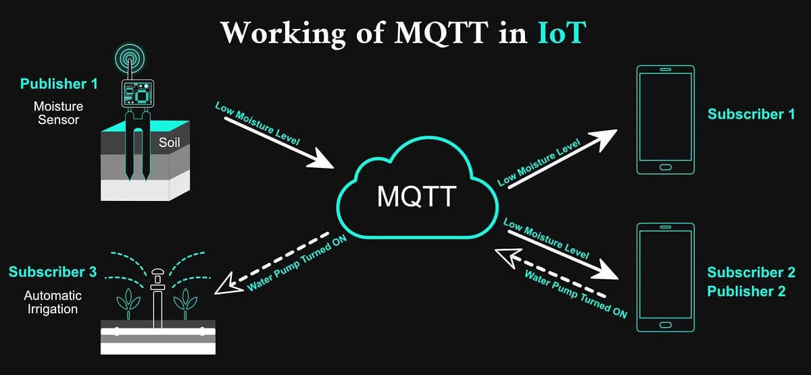

# MQTT v5 Client – Documentație Tehnică

## 1. Introducere
Protocolul **MQTT v5** (*Message Queuing Telemetry Transport*, versiunea 5.0) este un protocol ușor, optimizat pentru comunicații **machine-to-machine (M2M)** și **Internet of Things (IoT)**.  
Bazat pe modelul **publish–subscribe**, acesta funcționează peste stiva **TCP/IP**, oferind mecanisme de livrare fiabilă, control al fluxului și persistență a mesajelor.

În cadrul acestui proiect se implementează un **client MQTT v5** utilizând exclusiv modulul `socket` din Python, fără biblioteci externe.

Scopul proiectului este construirea unei aplicații demonstrative pentru **monitorizarea parametrilor de sistem** (CPU, memorie, temperatură) și publicarea acestora periodic pe topicuri MQTT dedicate.

Aplicația include o **interfață grafică (GUI)** care permite:
- configurarea conexiunii cu brokerul MQTT,
- alegerea ID-ului clientului și a mesajului *Last Will*,
- vizualizarea în timp real a parametrilor locali și a celor primiți de la alte instanțe ale aplicației.



---

## 2. Arhitectura aplicației
Aplicația este construită pe o arhitectură **client–broker**, conform specificației MQTT v5.  
Brokerul gestionează toate conexiunile și distribuie mesajele publicate către abonații corespunzători.

**Componente principale:**
- **Brokerul MQTT (HiveMQ 4.46)** – gestionează topicurile și distribuția mesajelor.  
- **Clientul MQTT v5 (`client.py`)** – implementează funcțiile principale ale protocolului MQTT (`CONNECT`, `PUBLISH`, `SUBSCRIBE`, `PINGREQ`, `DISCONNECT` etc.) utilizând doar `socket`.  
- **Interfața grafică (`gui.py`)** – oferă un panou de control pentru configurarea clientului și vizualizarea datelor.  
- **Modulul de monitorizare (`monitor.py`)** – colectează parametrii sistemului (CPU, RAM, temperatură) și îi publică periodic.  
- **Protocolul (`protocol.py`)** – definește formatele binare ale pachetelor MQTT v5 și mecanismele QoS.

---

## 3. Protocolul de comunicație MQTT v5

### Model de comunicare
MQTT folosește un model **publish–subscribe**, în care:
- **Publisherul** trimite mesaje pe un *topic*.
- **Subscriberul** primește mesajele publicate pe topicurile la care este abonat.
- **Brokerul** central gestionează toate mesajele și conexiunile.

Comunicarea se realizează prin **pachete binare** transmise prin socket TCP, structurate conform specificației MQTT v5.

### Tipuri de pachete implementate
- `CONNECT` / `CONNACK`
- `PUBLISH` / `PUBACK` / `PUBREC` / `PUBREL` / `PUBCOMP`
- `SUBSCRIBE` / `SUBACK`
- `PINGREQ` / `PINGRESP`
- `DISCONNECT`

### Structura generală a unui pachet MQTT v5
| Secțiune | Descriere |
|-----------|------------|
| **Fixed Header** | Tipul pachetului (4 biți), flag-uri și lungimea totală |
| **Variable Header** | Parametri specifici fiecărui tip de mesaj (ex: topic, ID pachet) |
| **Payload** | Conținutul efectiv (datele publicate) |

---

## 4. Funcționalități implementate

### 1. Configurare conexiune
Prin interfața grafică, utilizatorul poate introduce:
- adresa brokerului (IP / hostname),
- portul TCP (implicit **1883**),
- ID-ul clientului MQTT,
- mesajul **Last Will**,
- datele de autentificare (username, parolă).

### 2. Autentificare
Pachetul `CONNECT` include câmpurile:
- *User Name Flag* și *Password Flag* în Fixed Header,
- câmpurile de autentificare în Payload.

Astfel, brokerul poate verifica clientul înainte de a permite trimiterea de mesaje.

### 3. Mecanism **Keep Alive**
Mecanismul **Keep Alive** menține conexiunea activă între client și broker:
- Clientul transmite în pachetul `CONNECT` un câmp *Keep Alive* (în secunde).
- Trimite periodic un pachet `PINGREQ` dacă nu a existat trafic.
- Brokerul răspunde cu `PINGRESP`.
- Dacă brokerul nu primește `PINGREQ` în perioada specificată → conexiunea se închide și brokerul publică *Last Will*.

### 4. Mecanisme **QoS (Quality of Service)**
Aplicația implementează toate cele trei niveluri QoS definite de MQTT:

| Nivel | Descriere | Caracteristici |
|-------|------------|----------------|
| **QoS 0 – At most once** | Mesaj trimis o singură dată fără confirmare | Fără garanție, rapid |
| **QoS 1 – At least once** | Mesaj retransmis până la confirmare `PUBACK` | Posibilă duplicare |
| **QoS 2 – Exactly once** | Flux complet: `PUBLISH → PUBREC → PUBREL → PUBCOMP` | Garanție unică livrare |

### 5. Mecanism **Last Will**
Mesajul *Last Will* este publicat automat de broker în caz de deconectare neașteptată a clientului, informând ceilalți abonați.

---

## 5. Aplicație demonstrativă – Monitorizare sistem

Clientul colectează și publică periodic parametrii sistemului:

| Parametru | Descriere | Topic MQTT |
|------------|------------|-------------|
| `cpu_load` | Gradul de utilizare al procesorului (%) | `sistem/<client_id>/cpu` |
| `mem_usage` | Memorie utilizată (%) | `sistem/<client_id>/mem` |
| `temperature` | Temperatura procesorului (°C) | `sistem/<client_id>/temp` |

Publicarea se face la fiecare **5 secunde** în format JSON:

```json
{
  "cpu": 47.5,
  "ram": 62.1,
  "temperatura": 54.3,
  "uptime": 13425
}
```

QoS-ul se poate selecta din interfață.

---

## 6. Interfața grafică (GUI)

Interfața, realizată cu **Tkinter**, oferă următoarele componente:

| Componentă | Rol |
|-------------|-----|
| **Broker address** | Adresa IP sau numele brokerului |
| **Port** | Portul TCP (implicit 1883) |
| **Client ID** | Identificator unic al clientului |
| **Username / Password** | Date de autentificare |
| **Last Will message** | Mesaj publicat automat la deconectare |
| **Keep Alive** | Interval PINGREQ |
| **QoS** | Nivel QoS pentru publicare |
| **Connect / Disconnect** | Inițiere / terminare conexiune |
| **Start / Stop Monitor** | Control publicare periodică |
| **Log Window** | Evenimente MQTT (connect, publish, ping etc.) |
| **Received Data Table** | Parametrii primiți de la alte instanțe |

---

## 7. Structura modulelor

Aplicația este modulară, separând clar logica de comunicație, GUI-ul și partea de monitorizare.

### `client.py`
- Modulul principal.
- Inițializează conexiunea TCP cu brokerul.
- Construiește și trimite pachetele MQTT (`CONNECT`, `PUBLISH`, `SUBSCRIBE`, `PINGREQ`, `DISCONNECT`).
- Primește răspunsurile (`CONNACK`, `PUBACK`, `PINGRESP` etc.).
- Gestionează autentificarea, *Last Will*, *Keep Alive* și reconectarea automată.

### `protocol.py`
- Definește funcțiile de construcție și interpretare a pachetelor MQTT v5.
- Exemple de funcții:
  - `encode_connect()`, `decode_connack()`
  - `encode_publish()`, `decode_puback()`
  - `encode_subscribe()`, `decode_suback()`
  - `encode_pingreq()`, `decode_pingresp()`
  - `encode_disconnect()`
- Respectă structura oficială MQTT, incluzând calculul *Remaining Length*.

### `monitor.py`
- Colectează date despre sistem (CPU, RAM, temperatură, uptime).
- Utilizează biblioteci standard (`os`, `psutil`, `platform`).
- Trimite valorile către `client.py` pentru publicare periodică.

### `gui.py`
- Implementează interfața grafică cu **Tkinter**.
- Permite configurarea conexiunii și controlul monitorizării.
- Afișează în timp real mesajele publicate și primite.

---

## 8. Testare și demonstrații

### Scenariu 1 – Conectare și autentificare
- Clientul se conectează la broker cu user/parolă.
- Brokerul răspunde cu `CONNACK` (cod 0 – succes).
- În caz de credentiale invalide → cod de eroare.

### Scenariu 2 – Publicare QoS 0 / 1 / 2
- QoS 0: mesaje fără ACK.
- QoS 1: `PUBACK` și retransmisie la timeout.
- QoS 2: flux complet `PUBREC → PUBREL → PUBCOMP`.

### Scenariu 3 – Keep Alive
- `PINGREQ` la fiecare 60 secunde.
- `PINGRESP` de la broker.
- La lipsa răspunsului → reconectare automată.

### Scenariu 4 – Pierdere conexiune și Last Will
- Clientul este închis forțat.
- Brokerul publică *Last Will*.
- Alte instanțe primesc notificarea.

---

## 9. Concluzii
Proiectul demonstrează posibilitatea implementării unui **client MQTT v5 complet funcțional**, utilizând doar biblioteca `socket`.

**Rezultate obținute:**
- Transmiterea corectă a pachetelor binare MQTT.
- Implementarea completă a mecanismelor QoS 0–2.
- Menținerea conexiunii prin Keep Alive.
- Autentificare și mesaj Last Will.
- Monitorizare distribuită în timp real.

---

## 10. Bibliografie
1. [**MQTT Version 5.0 Specification**, OASIS Standard, 2019](https://docs.oasis-open.org/mqtt/mqtt/v5.0/mqtt-v5.0.html)  
2. [**HiveMQ – MQTT Essentials (Part 5–10)**](https://www.hivemq.com/mqtt-essentials/)  
3. [**IBM Developer – MQTT v5 Explained**](https://developer.ibm.com/articles/iot-mqtt-why-good-for-iot/)  
4. [**RFC 6455 – Transmission Control Protocol (TCP)**](https://datatracker.ietf.org/doc/html/rfc6455)  
5. [**Python socket Module – Official Documentation**](https://docs.python.org/3/library/socket.html)
